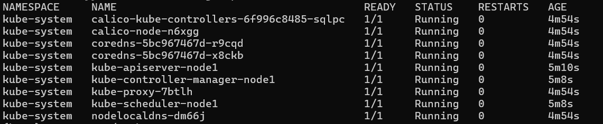
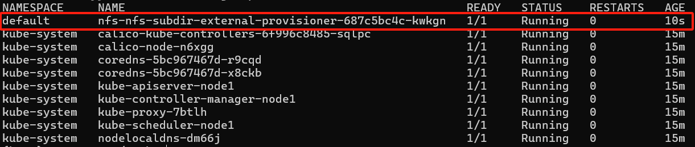
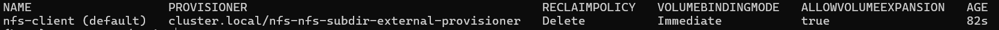
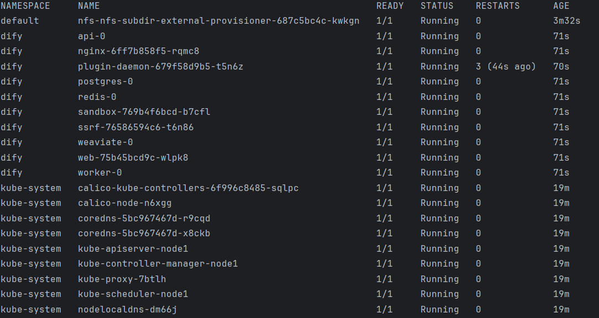
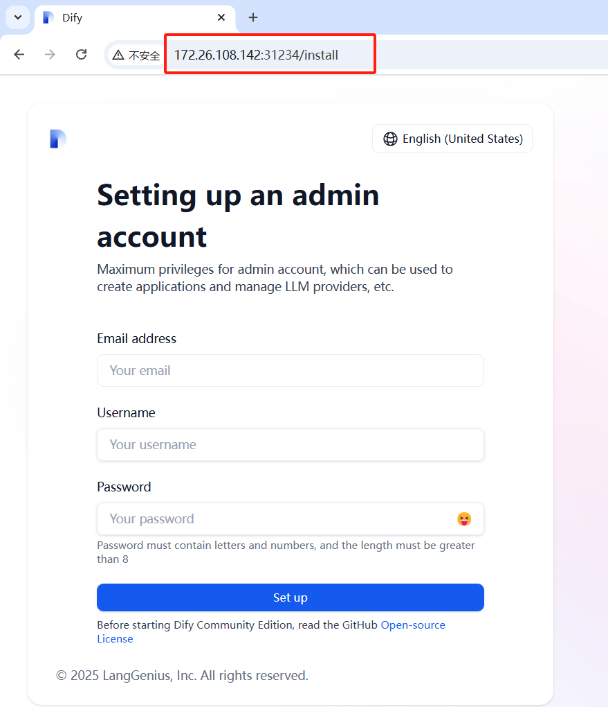

# dify-k8s
    
    The entire yaml depends on the docker-compose.yaml file.
    All configuration items are retained, such as uploading files to OSS, switching vector databases, etc.
    Currently, YAML will do PVC storage. If it is not needed, please handle it yourself.

    If you use a local database, then you need to have a storageClass.
    
# Currently supported dify versions: V1.7.2

## usage

### create a kubernetes cluster

### Set a default storage class()

### create dify cluster   

### Visit the front-end page

## upgrade

 - Modify the dify-k8s.yaml file
 - kubectl apply -f dify-k8s.yaml
 - kubectl rollout restart statefulset/deployment your-pod-name -n dify

## notes
 
 - Please modify YAML files according to your own needs, such as changing storageClass to your own
 - If you need to call your application's external API, simply go to the API call page and set the key. Don't forget to bring the default port 31234
 - Almost all configuration items are converted from the official docker-compose.yaml. For example, if you need to modify it to external redistribution, just follow the official instructions.